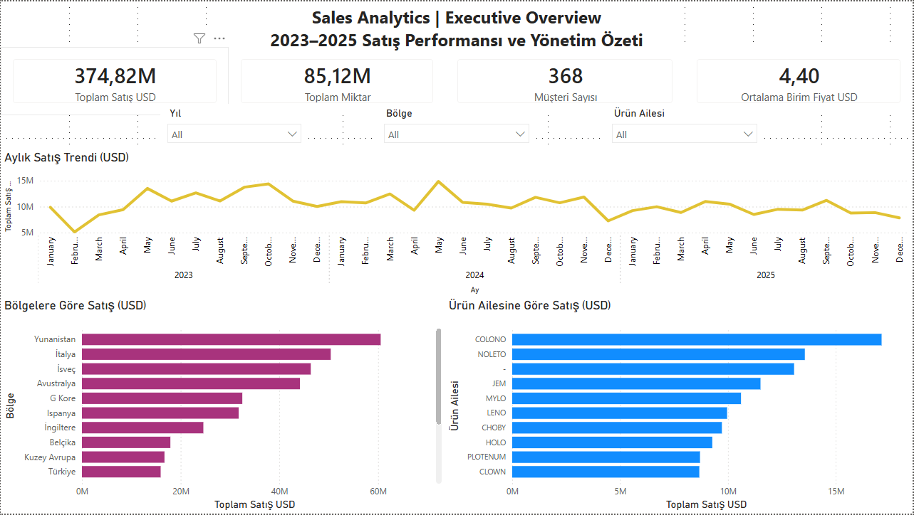
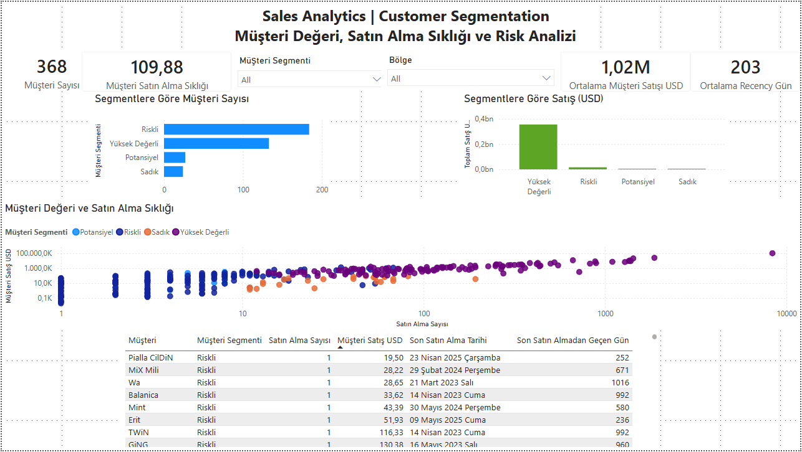
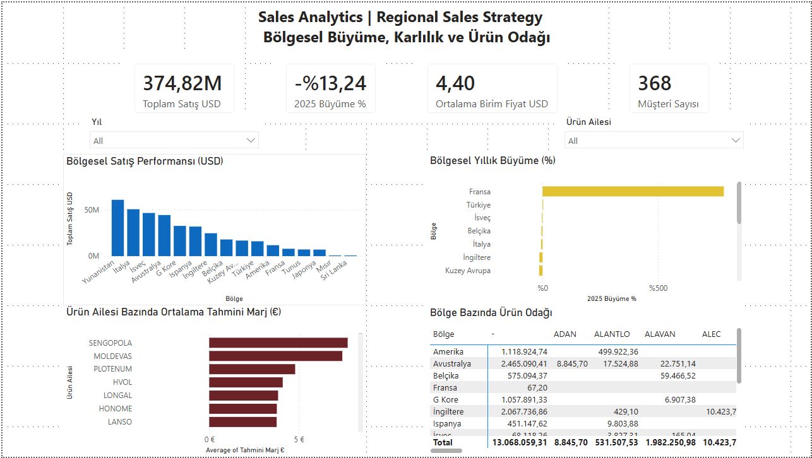
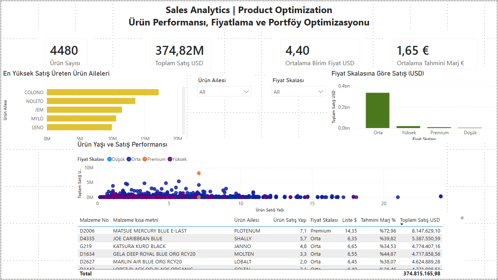

# Satış Analitiği ve Power BI Dashboard Çalışması

Bu proje, **ACV İTÜ SEM İleri Veri Analitiği Eğitimi** kapsamında hazırlanan üçüncü case study çalışmasıdır.

Çalışmada 2023–2025 dönemine ait satış verileri Power BI kullanılarak analiz edilmiştir. Veri temizleme, veri modelleme, DAX hesaplamaları, müşteri segmentasyonu, bölgesel satış analizi ve ürün portföy optimizasyonu gerçekleştirilmiş; sonuçlar dört farklı yönetim dashboard'u üzerinden sunulmuştur.

## Projenin Amacı

Bu çalışmanın temel amaçları:

- 2023–2025 dönemindeki satış performansını analiz etmek
- Bölgesel satış farklılıklarını ve büyüme eğilimlerini karşılaştırmak
- Müşteri satın alma davranışlarını incelemek
- Müşterileri değer, satın alma sıklığı ve güncellik kriterlerine göre segmentlere ayırmak
- Ürün aileleri ve fiyat segmentlerinin satış performansını değerlendirmek
- Ürünlerin tahmini marjlarını analiz etmek
- Bölge bazında ürün odaklarını belirlemek
- Ürün yaşı, satış performansı ve fiyat seviyesi arasındaki ilişkiyi incelemek
- Yönetim kararlarını destekleyen interaktif Power BI dashboard'ları geliştirmek

## Veri Seti

Analizde kullanılan Excel dosyası satış, ürün ve fiyat bilgilerini içeren farklı sayfalardan oluşmaktadır.

| Veri Grubu | Açıklama |
|---|---|
| `Satış Verileri` | Satış belgesi, tarih, müşteri, ürün, bölge, miktar ve fatura tutarları |
| `Satış Türü` | Satış belge türlerinin sınıflandırılması |
| `Ürün Detay` | Ürün kodu, ürün açıklaması, malzeme grubu ve ürün tarihi |
| `Ürün Fiyat` | USD ve EUR liste fiyatları ile birim maliyet |
| `Ürün Aile Konsept` | Ürün ailesi, koleksiyon ve konsept bilgileri |

Ham veri dosyası eğitim kapsamında tarafıma sağlandığı için GitHub reposuna dahil edilmemiştir.

## Veri Hazırlama

Veri temizleme ve dönüştürme işlemleri **Power Query** kullanılarak gerçekleştirilmiştir.

- Kolon veri tipleri kontrol edildi ve düzeltildi.
- Bölge alanındaki farklı yazım biçimleri standartlaştırıldı.
- Hatalı ve eksik tarih değerleri kontrol edildi.
- Kaynak dosyadaki `#N/A` ve benzeri hatalar uygun alanlarda null değerlere dönüştürüldü.
- Excel biçimlendirmesinden kaynaklanan gereksiz boş satırlar filtrelendi.
- Ürün tablolarında `Malzeme No` alanı boş olan kayıtlar temizlendi.
- Ürün detay, fiyat ve sınıflandırma tabloları `Malzeme No` üzerinden birleştirildi.
- Yardımcı sorguların model yüklemesi kapatıldı.

## Veri Modeli

Power BI içerisinde yıldız şema yaklaşımına uygun bir veri modeli oluşturulmuştur.

Ana tablolar:

- `FactSales`
- `DimProduct`
- `DimSalesType`
- `DimDate`
- `DimCustomer`

Temel ilişkiler:

```text
DimSalesType (1) ── (*) FactSales
DimProduct   (1) ── (*) FactSales
DimDate      (1) ── (*) FactSales
DimCustomer  (1) ── (*) FactSales
```

İlişkilerde **1:N cardinality** ve **Single cross-filter direction** kullanılmıştır.

## DAX Hesaplamaları

### Satış Metrikleri

- Toplam Satış USD
- Toplam Miktar
- Müşteri Sayısı
- Ürün Sayısı
- Ortalama Birim Fiyat USD
- Satın Alma Sayısı
- Müşteri Satın Alma Sıklığı

### Zaman Analizi

- Geçen Yıl Satış USD
- 2024 Satış USD
- 2025 Satış USD
- 2025 Büyüme %
- Aylık ve yıllık satış trendleri

### Ürün Analizi

- Birim Fiyat USD
- Ürün Satış Yaşı
- Fiyat Skalası
- Tahmini Marj €
- Tahmini Marj %
- Ortalama Tahmini Marj €

### Müşteri Analizi

- Müşteri Satış USD
- Son Satın Alma Tarihi
- Son Satın Almadan Geçen Gün
- Ortalama Müşteri Satışı USD
- Ortalama Recency Gün

## Müşteri Segmentasyonu

Müşteriler, RFM yaklaşımından esinlenen üç temel davranış metriğine göre analiz edilmiştir:

- **Recency:** Son satın alma üzerinden geçen gün
- **Frequency:** Satın alma sayısı
- **Monetary:** Müşterinin oluşturduğu satış değeri

Segment eşikleri veri dağılımındaki medyan değerlere göre belirlenmiştir.

| Segment | Açıklama |
|---|---|
| Yüksek Değerli | Yüksek satın alma sıklığı ve yüksek satış değeri oluşturan güncel müşteriler |
| Sadık | Düzenli ve yakın zamanda satın alma yapan müşteriler |
| Potansiyel | Daha düşük satın alma sıklığına sahip ancak güncel müşteriler |
| Riskli | Son satın almasının üzerinden daha uzun süre geçmiş müşteriler |

Segmentasyon kesin bir churn veya kredi riski tahmini değildir; mevcut veri dağılımına dayalı operasyonel müşteri gruplarıdır.

## Dashboard'lar

### 1. Executive Overview

Yönetim seviyesinde genel satış performansını özetler.

- Toplam satış
- Toplam miktar
- Müşteri sayısı
- Ortalama birim fiyat
- Aylık satış trendi
- Bölgelere göre satış
- Ürün ailelerine göre satış



### 2. Customer Segmentation

Müşteri değerini, satın alma sıklığını ve müşteri riskini analiz eder.

- Müşteri sayısı ve satın alma sıklığı
- Ortalama müşteri satış değeri ve recency
- Segmentlere göre müşteri dağılımı
- Segmentlere göre satış
- Satın alma sıklığı ve müşteri değeri scatter analizi
- Müşteri detay tablosu



### 3. Regional Sales Strategy

Bölgeleri satış, büyüme, tahmini marj ve ürün odağı açısından karşılaştırır.

- Bölgesel satış performansı
- 2025–2024 satış büyümesi
- Ürün ailesi bazında ortalama tahmini marj
- Bölge ve ürün ailesi satış matrisi



### 4. Product Optimization

Ürün performansı, fiyatlandırma ve ürün portföyünü değerlendirir.

- Toplam ürün sayısı
- Toplam satış ve ortalama birim fiyat
- Ortalama tahmini marj
- En yüksek satış üreten ürün aileleri
- Fiyat skalasına göre satış
- Ürün yaşı ve satış performansı
- Ürün bazlı detay tablosu



## Öne Çıkan Bulgular

- 2023–2025 döneminde toplam satış yaklaşık **374,82 milyon USD** olarak hesaplanmıştır.
- Analiz kapsamında **368 benzersiz müşteri** ve **4.480 ürün** bulunmaktadır.
- Ortalama satış birim fiyatı yaklaşık **4,40 USD** seviyesindedir.
- 2025 toplam satışları 2024 yılına göre yaklaşık **%13,24 azalmıştır**.
- Bölgesel satış performansında Yunanistan, İtalya, İsveç ve Avustralya öne çıkmaktadır.
- Yüksek Değerli müşteri segmenti toplam satışların önemli bir bölümünü oluşturmaktadır.
- Riskli segment müşteri sayısı açısından dikkat çekici büyüklüktedir ve yeniden kazanım çalışmaları için öncelikli bir grup olabilir.
- Orta fiyat segmentindeki ürünler toplam satışın önemli bir bölümünü oluşturmaktadır.
- Bazı eski ürünler yüksek satış üretmeye devam ettiği için ürün yaşı tek başına portföyden çıkarma kriteri olarak kullanılmamalıdır.
- Tahmini marj ve satış performansının birlikte değerlendirilmesi ürün önceliklendirme kararlarını desteklemektedir.

## İş Önerileri

- Satışların gerilediği bölgelerde müşteri ve ürün bazlı detay analizleri yapılarak bölgesel aksiyon planları geliştirilebilir.
- Yüksek büyüme gösteren bölgelerde satış ve pazarlama yatırımları artırılabilir.
- Yüksek Değerli müşteriler için sadakat ve çapraz satış programları uygulanabilir.
- Riskli müşterilere yönelik yeniden kazanım kampanyaları geliştirilebilir.
- Yüksek satış ve yüksek tahmini marj üreten ürün aileleri önceliklendirilebilir.
- Yüksek satış ancak düşük marj oluşturan ürünlerin fiyatlama ve maliyet yapısı tekrar değerlendirilebilir.
- Ürün portföyü optimizasyonunda ürün yaşı; satış hacmi, fiyat seviyesi ve marj ile birlikte değerlendirilmelidir.
- Bölge bazındaki ürün satış matrisi kullanılarak her bölge için farklı ürün odakları oluşturulabilir.

## Proje Yapısı

```text
sales-analytics-powerbi-case-study/
│
├── README.md
├── Sales_Analytics_PowerBI_Case_Study_Betul_Kizilkaya.pbix
└── screenshots/
    ├── 01-executive-overview.png
    ├── 02-customer-segmentation.png
    ├── 03-regional-sales-strategy.png
    └── 04-product-optimization.png
```

## Kullanılan Teknolojiler

- Microsoft Power BI Desktop
- Power Query
- DAX
- Microsoft Excel
- Veri Modelleme
- Veri Görselleştirme
- Müşteri Segmentasyonu
- GitHub Desktop

## Veri Gizliliği

Analizde kullanılan ham Excel dosyası eğitim kapsamında tarafıma sağlanmıştır. Bu nedenle ham veri dosyası GitHub reposuna dahil edilmemiştir.

Repo yalnızca Power BI çalışmasını, dashboard ekran görüntülerini ve proje dokümantasyonunu içermektedir.

## Yöntem Notları

- Veri modelinde yıldız şema yaklaşımı kullanılmıştır.
- Kaynak Excel dosyasındaki gereksiz boş ve formatlanmış satırlar Power Query ile temizlenmiştir.
- Ürün detay, fiyat ve sınıflandırma bilgileri `Malzeme No` üzerinden birleştirilmiştir.
- Zaman analizleri için ayrı bir `DimDate` tablosu oluşturulmuştur.
- Müşteri segmentasyonu Recency, Frequency ve Monetary metrikleri kullanılarak gerçekleştirilmiştir.
- Segment eşikleri veri dağılımının medyan değerlerine göre belirlenmiştir.
- Tahmini marj analizi EUR liste fiyatı ve birim maliyet arasındaki fark üzerinden hesaplanmıştır; gerçek muhasebe kârı olarak değerlendirilmemelidir.
- 2025 büyüme oranı 2025 satışlarının 2024 satışlarıyla karşılaştırılmasıyla hesaplanmıştır.
- Ham veri reposuna dahil edilmemiştir.

## Hazırlayan

**Betül Kızılkaya**

ACV İTÜ SEM İleri Veri Analitiği Eğitimi  
Case Study 03
